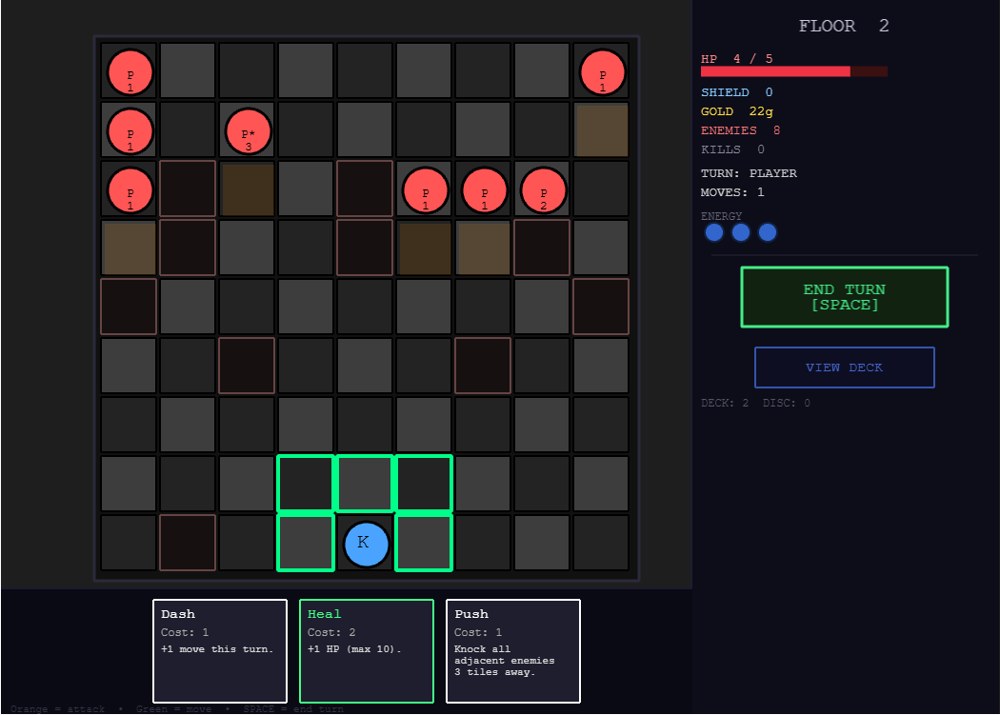
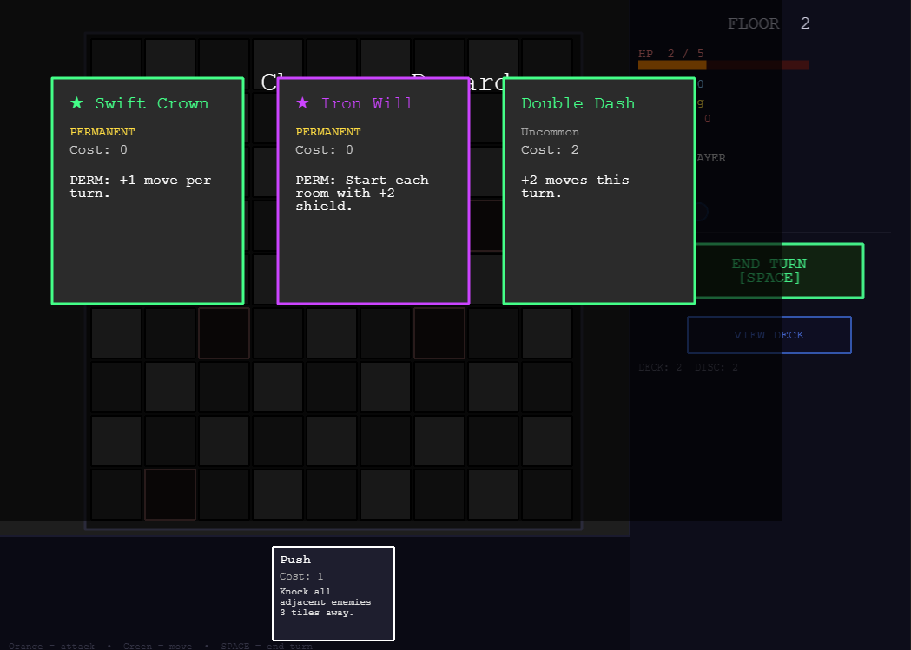
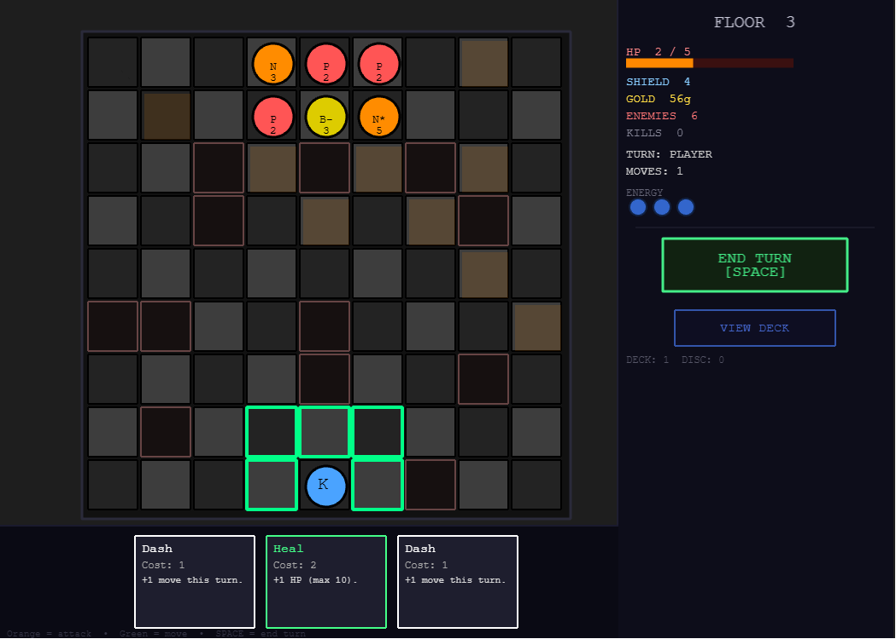
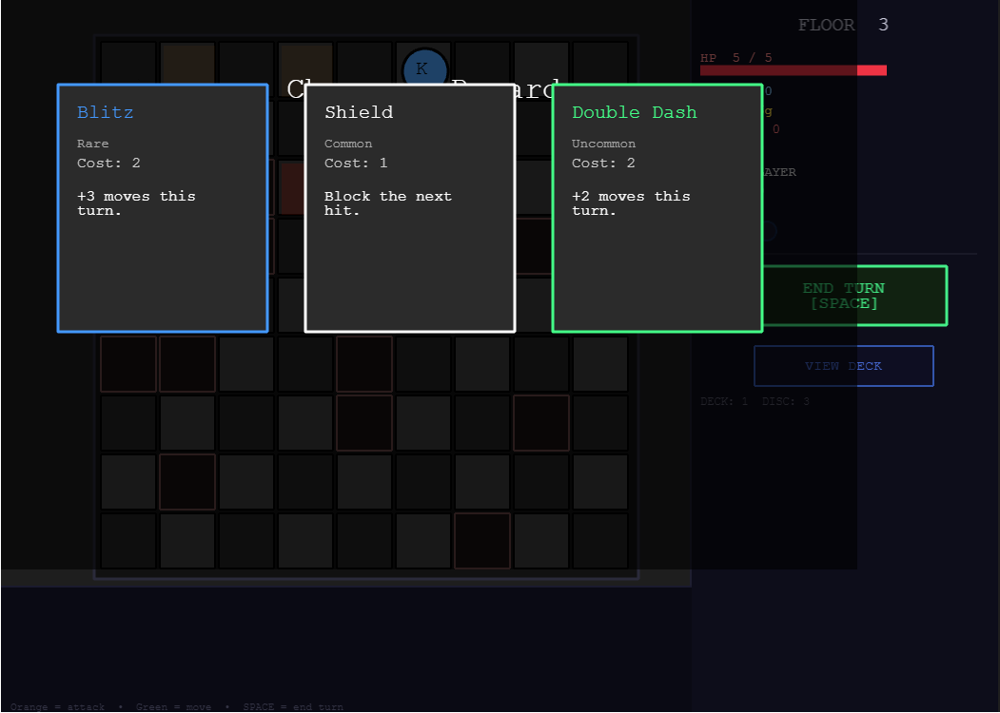
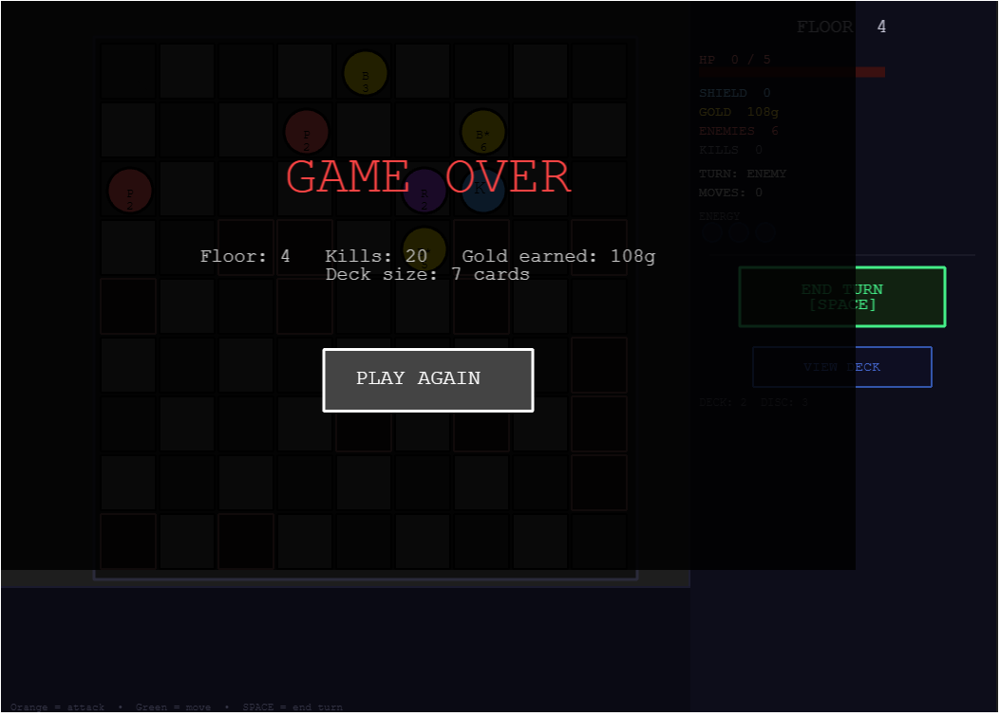
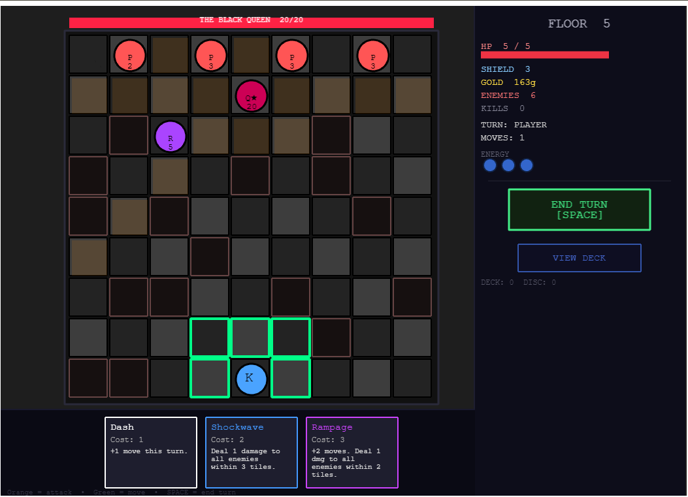

# Chess Roguelike

# Playable Link:  https://angelcasta34.github.io/chess-rougelike/

# Play Tester Survey

https://docs.google.com/forms/d/e/1FAIpQLSe4G8WCs27SQc3Bu50jtF_JH7pfkVouLlkL9knlEkIuvExk5Q/viewform?usp=publish-editor 

A roguelike deckbuilder built with Phaser 3 where you play as a King piece navigating procedurally generated chess encounters. Each run is unique, enemy waves, card rewards, board layouts, and room sequences are all generated at runtime.

---

## How to Run

```bash
npm install
npm run dev
```

Then open `http://localhost:5173` in your browser.

---

## How to Play

- **Click a highlighted tile** to move your King (green border = move, orange border = attack)
- **Click a card** in your hand to play it (costs energy). Each card can only be played once per turn
- **Scroll through your hand** with the mouse wheel or the ◀ / ▶ arrow buttons at the bottom
- **SPACE or END TURN button** to end your turn and let enemies move
- Clear all enemies to advance — pick a new room, earn a card reward
- Press **ESC** or click **≡** to open the pause menu at any time
- Survive all 20 floors and defeat the final boss to win

---

## Generative Systems

The game uses four interconnected generative systems to ensure every run feels different.

---

### 1. Loot Table — Card Reward Generation
**File:** `src/generators/LootTable.js`
**Original Tool:** [CMPM147 Loot Table Generator](https://github.com/mtang44/CMPM147-Loot-Table-Generator/tree/main) (C# / Unity)

This system is a direct JavaScript port of the **C# LootChest weighted rarity algorithm** from the CMPM147 Loot Table Generator. The core algorithm is preserved exactly, only the language and data structures changed to fit a Phaser 3 / JS context.

---

#### Original C# Algorithm (`LootChest.cs`)

The original `GenerateLoot()` method works in 6 steps:

1. **`insertCustomLootTable()`** — Builds a `Dictionary<string, List<gameItem>>` organizing items by rarity
2. **`insertCustomRarities()`** — Calculates the weighted sum of all rarities
3. Roll `rand.Next(0, weightedSum)`
4. Walk through rarities subtracting each weight — first rarity that drives the roll below 0 is selected
5. Retrieve the item list for that rarity
6. Pick a random item: `itemList[rand.Next(0, itemList.Count)]`

Original C# rarity weights: `Rarity_Weights = {55, 30, 15, 6, 1}`

```csharp
// Original C# core loop (GenerateLoot)
foreach (KeyValuePair<string, int> rarity in rarityDictionary) {
    roll -= rarity.Value;
    if (roll < 0) {
        selectedRarity = rarity.Key;
        break;
    }
}
selectedItem = itemList[rand.Next(0, itemList.Count)];
```

---

#### JavaScript Port (`src/generators/LootTable.js`)

Each step maps directly to the C# original:

| C# Method | JS Equivalent | What it does |
| --- | --- | --- |
| `insertCustomLootTable()` | `_buildRarityMap(candidates)` | Groups cards into a map by rarity |
| `insertCustomRarities()` | weight sum in `_rollRarity()` | Sums all weights |
| `rand.Next(0, weightedSum)` | `Math.floor(Math.random() * weightedSum)` | Random roll |
| Subtraction loop | `roll -= weight; if (roll < 0)` | Selects winning rarity |
| `itemList[rand.Next(...)]` | `pool[Math.floor(Math.random() * pool.length)]` | Picks random card |

```js
// Step 1 — mirrors insertCustomLootTable()
_buildRarityMap(candidates) {
  const map = {};
  for (const card of candidates) {
    if (!map[card.rarity]) map[card.rarity] = [];
    map[card.rarity].push(card);
  }
  return map;
}

// Steps 2–4 — mirrors insertCustomRarities() + GenerateLoot() subtraction loop
_rollRarity(weights) {
  let weightedSum = 0;
  for (const w of Object.values(weights)) weightedSum += w;

  let roll = Math.floor(Math.random() * weightedSum);
  for (const [rarity, weight] of Object.entries(weights)) {
    roll -= weight;
    if (roll < 0) return rarity;
  }
}

// Steps 5–6 — pick card from winning rarity's pool
drawOptions(tableId, count, opts) {
  const rarityMap = this._buildRarityMap(candidates);   // step 1
  const rarity    = this._rollRarity(weights);           // steps 2–4
  const pool      = rarityMap[rarity];                   // step 5
  const card      = pool[Math.floor(Math.random() * pool.length)]; // step 6
}
```

---

#### Rarity Weights

Matching the C# default `Rarity_Weights = {55, 30, 15, 6, 1}`, with a second table added for elite/boss rooms:

| Rarity    | Fight Room (`reward_fight`) | Elite Room (`reward_elite`) |
|-----------|-----------------------------|-----------------------------|
| Common    | 55                          | 25                          |
| Uncommon  | 30                          | 35                          |
| Rare      | 15                          | 25                          |
| Epic      | 6                           | 12                          |
| Legendary | 1                           | 3                           |

---

#### Extensions Beyond the Base Tool

The original C# tool generates loot from a static CSV. This port adds game-specific extensions while keeping the core algorithm intact:

- **Two loot tables**: `reward_fight` (default weights) and `reward_elite` (skewed toward higher rarities for boss/elite rooms)
- **Pity system**: If no Rare+ card appears in N consecutive rooms, Rare/Epic/Legendary weights increase proportionally each draw
- **Tag filtering**: Rewards can be pre-filtered by tag (`"movement"`, `"defense"`) before the rarity roll — falls back to the full pool if no tagged cards exist for the rolled rarity
- **Duplicate prevention**: The same card won't appear twice in the same reward screen when the pool is large enough

#### Where It's Called

```js
// GameScene.js — onVictory(), after clearing a room
const options = [
  ...this.lootTable.drawOptions("reward_fight", 1, { tag: "movement", pity }),
  ...this.lootTable.drawOptions("reward_fight", 1, { tag: "defense",  pity }),
  ...this.lootTable.drawOptions("reward_fight", 1, { pity }),
];
```
Three draws are made per reward screen — one biased toward movement cards, one toward defense, one unfiltered — guaranteeing variety in every offer.

---

### 2. Enemy Wave Generation
**File:** `src/generators/EnemyFactory.js`

A budget-based system that generates a unique set of enemy stat blocks each room.

- **Budget**: `3 + floor*2 + random variance` — grows and becomes less predictable on higher floors
- **Piece types unlock by floor**: Pawns (floor 1) → Knights/Bishops (2–3) → Rooks (4) → Queens (6+)
- **Per-enemy stat scaling**: HP increases every 3 floors with a 30% variance roll; ATK increases on floor 5+
- **Modifiers**: Armored (+2 HP), Vicious (+1 ATK), Elite (+2 HP +1 ATK), Frail (-1 HP) — chance scales from 10% on floor 1 to 55% cap

---

### 3. Encounter Placement
**File:** `src/systems/EncounterTemplates.js`

Takes the generated enemy stat blocks and places them on the board using one of 5 randomly selected strategies:

| Strategy  | Description |
|-----------|-------------|
| Spread    | Random positions across the top 3 rows |
| Flanks    | Heavy pieces on the edges, light pieces in the center |
| Vanguard  | Strongest enemies pushed to the front row |
| Pincer    | Enemies split into two groups on opposite sides |
| Column    | Enemies packed into 1–3 central columns |

---

### 4. Board & Room Generation
**File:** `src/board/Board.js`, `src/scenes/GameScene.js`

- **Wall generation**: Each room places `6 + floor*2` walls (capped at 22) in random positions, with safe zones around the king start and enemy spawn rows
- **Room map**: After each fight, 3 room type options are randomly weighted from: Fight, Elite, Rest, Shop, Treasure — with Boss forced every 5th floor and a Shrine before the boss

---

## Card System

**File:** `src/cards/CardList.js`, `src/cards/CardSystem.js`

The game has 40+ cards spanning 5 rarities. Cards are drawn into a scrollable hand at the bottom of the screen (4 visible at a time). Each card can only be played **once per turn** — played cards show a red "USED" badge and are grayed out until the next turn.

### Card Categories

| Category | Examples |
| --- | --- |
| Movement | Dash, Blitz, Charge, Momentum (permanent) |
| Defense | Shield, Fortify, Iron Skin, Shield Bash, Emergency |
| Healing | Heal, Mend |
| Draw / Energy | Study (draw 2), Meditate (discard/draw 5), Scry (draw 3 + energy), Gambit (risk HP for energy) |
| Offense | Cleave (2 dmg adjacent), Vengeance, Overload (AoE + burn), Plague (burn3 in range), Time Stop (freeze all) |
| Utility | Gold Rush (+20g), Push, Weaken |
| Permanents | Swift Crown, Iron Will, Resilient (+maxHP), Bloodthirst (kill → energy), Momentum (+moves/-max energy) |

### Shop Prices

| Rarity | Buy | Remove |
| --- | --- | --- |
| Common | 20g | 25g |
| Uncommon | 38g | 25g |
| Rare | 60g | 25g |
| Epic | 90g | 25g |
| Legendary | 140g | 25g |

---

## Room Types

| Room | Description |
| --- | --- |
| Fight | Clear enemies, earn a card reward |
| Elite | Harder enemies, better card reward |
| Rest | Heal 3 HP + 30 gold, no combat |
| Shop | Buy or remove cards |
| Treasure | Gold scaled to floor + choose a bonus blessing |
| Shrine | Choose a blessing before the boss floor |
| Boss | Boss fight every 5th floor — Legendary reward |

---

## Audio

- **Dungeon music**: "Big Helmet" plays during normal and elite rooms
- **Boss music**: "Never Meant to Belong" fades in during boss fights, fades back to dungeon music on victory
- Music cross-fades smoothly using Phaser tweens on volume

---

## Project Structure

```
src/
  board/
    Board.js                  # Board rendering, piece movement, combat
  cards/
    CardList.js               # All card definitions and effects (40+ cards)
    CardSystem.js             # Scrollable hand rendering, reward screen, play-once enforcement
  generators/
    EnemyFactory.js           # Budget-based enemy stat generation
    LootTable.js              # Weighted rarity card reward generation (C# port)
  scenes/
    MenuScene.js              # Title screen, How to Play overlay, menu music
    GameScene.js              # Main game loop, UI, roguelike flow
  systems/
    EnemyAI.js                # Chess movement logic for all 5 piece types
    EncounterTemplates.js     # Procedural enemy placement strategies
    ShopSystem.js             # Buy/remove cards shop overlay
    SoundManager.js           # Procedural Web Audio SFX
    StatusEffects.js          # Burning, frozen, weakened status effects
    TurnManager.js            # Player/enemy turn sequencing
assets/
  music/                      # Background music tracks (MP3)
  chessPieces/                # Piece sprites
```

---

## Example Generated Outputs

Each run produces a different combination of enemy composition, board layout, and card rewards. The screenshots below are from the `SCREENSHOTS/` folder and show a full run from Floor 1 through Game Over.

**Screenshot 1 — Floor 1 combat (run A)**

6 Pawns, spread formation, walls randomized around the board.

**Screenshot 2 — Floor 1 combat (run B)**

Same floor, different wall layout and enemy positions — Vanguard-style clustering on the left.

**Screenshot 3 — Card reward screen (after Floor 1)**

Weighted loot table offers Push (Common), Heal (Uncommon), Shield (Common) — tag-filtered draws.

**Screenshot 4 — Room choice screen**

After clearing a room, three room types are randomly weighted: Rest, Fight, Shop.

**Screenshot 5 — Floor 2 combat**

8 enemies, higher budget, P*3 modifier (Armored Pawn), more walls than Floor 1.

**Screenshot 6 — Floor 2 Rare reward**

Loot table rolls a Rare (Swift Crown PERMANENT) and a PERMANENT (Iron Will) — higher rarities visible.

**Screenshot 7 — Floor 3 with Knights and Bishops**

New piece types unlock: Knights (N, orange) and Bishops (B, yellow) appear for the first time.

**Screenshot 8 — Floor 3 reward with Rare card**

Blitz (Rare, blue border) offered alongside Common and Uncommon — rarity variation across runs.

**Screenshot 9 — Game Over on Floor 4**

Run ended on Floor 4 with 20 kills, 108g gold, 7-card deck built across the run.

**Screenshot 10 — Boss Fight**

Boss encounter triggered every 5th floor — Queen piece with elevated HP and ATK, unique placement strategy.

**Variation across runs comes from:**

- Budget-rolled enemy counts and types per floor
- Random modifier rolls (Armored, Vicious, Frail, Elite) on individual enemies
- One of 5 placement strategies selected per room
- Wall count and position re-randomized each room
- Card reward pool filtered by tag (movement/defense/any) with weighted rarity rolls and pity tracking
- Room path choices (Fight / Elite / Rest / Shop / Treasure) weighted randomly after each victory

---

## Risk Review

### Risk 1 — Enemy Displacement on Crowded Boards (High Priority)

**What it is:** When an enemy is displaced by a card, the code searches for a safe landing tile. On high floors with 20+ walls and multiple enemies, the fallback search can exhaust all 500 attempts and silently destroy the enemy instead of moving it. This could let the player accidentally delete enemies with no feedback, or fail silently in ways that feel like bugs.

**Plan to address:** Add a minimum-enemy safeguard and log/display a message when destruction fallback triggers. Clamp wall generation earlier to prevent overcrowding before it reaches displacement logic.

---

### Risk 2 — Balance Scaling at Higher Floors (Medium Priority)

**What it is:** Enemy budget, HP, and ATK scale with floor number, but the card pool and player HP do not scale. A player who picks weak cards early may hit a wall around floor 6–8 where enemies are significantly tankier with no recovery path. Roguelike balance is hard to tune without playtesting data. An unwinnable mid-run state that isn't the player's fault is a bad experience.

**Plan to address:** Tune the Elite loot table to offer stronger cards sooner, and add a floor-aware difficulty cap on modifier stacking so floors 1–4 remain accessible.

---

### Risk 3 — UI Feedback Gaps (Lower Priority)

**What it is:** Several systems operate silently — the shop card removal has a silent-failure edge case, status effects don't always show clear visual indicators, and the threat map can briefly show ghost threats from already-dead enemies. Players need readable feedback to make decisions. Silent failures erode trust in the game's systems.

**Plan to address:** Add text popups for status applications, validate shop removals before charging gold, and clear the threat map immediately when an enemy dies mid-turn rather than waiting for end-of-turn cleanup.

---

## Plan Before Final Showcase

### Already Complete

- Core turn-based loop (player move → card play → end turn → enemy move)
- All 5 chess piece AI movement types
- 40+ cards across Common–Legendary rarity with play-once-per-turn enforcement
- Scrollable card hand with mouse wheel and arrow navigation
- Weighted loot table with pity system and tag filtering (C# port)
- Budget-based enemy wave generation with 5 placement strategies
- Procedural wall generation per room
- Status effects (Burning, Frozen, Weakened)
- Shop system (buy cards, remove cards)
- Treasure rooms and Shrine rooms with blessing choices
- Boss encounters every 5th floor with boss intro and unique music
- Background music with cross-fade (dungeon / boss tracks)
- Full roguelike progression (floor counter, room branching, game over screen)
- Full-window canvas scaling (Phaser Scale.FIT)
- Sidebar deck panel showing current hand
- Title screen with animated background and How to Play overlay
- In-game pause menu (ESC or ≡) with Resume, Restart Run, and Main Menu
- Win condition: defeat the Floor 20 boss to trigger a Victory screen
- Playtest survey distributed to testers
- Deployed to GitHub Pages

---

## Tech Stack

- **Phaser 3** — game framework (rendering, input, tweens, timers, Web Audio)
- **Vite** — dev server and bundler
- **Vanilla JS (ES Modules)** — no additional frameworks
